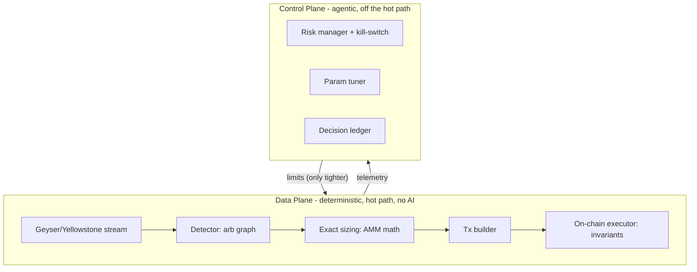

# Lorenz Protocol — deterministic, non-custodial on-chain arbitrage

[](https://github.com/lorenz-protocol/lorenz/actions/workflows/ci.yml)
[](LICENSE)
[](#what-this-repository-is-and-is-not)

> Experimental, open-source research platform for atomic, flash-loan-funded
> arbitrage on Solana, with an agentic control plane and safety guarantees
> enforced on-chain.

> An AI arbitrage hedge fund you own the keys to — open-source, non-custodial, deterministic.

**Status: experimental. Not production. No profitability claims.**
This repository is an engineering foundation under active development. It does
not trade live yet, it has not been audited, and nothing here is financial advice.
See [DISCLAIMER.md](DISCLAIMER.md).

---

## Contents

- [Why this exists](#why-this-exists)
- [What this repository is (and is not)](#what-this-repository-is-and-is-not)
- [Core idea in one picture](#core-idea-in-one-picture)
- [What actually works today](#what-actually-works-today-verifiable)
- [Production requirements](#production-requirements-what-a-live-deployment-additionally-needs)
- [Repository layout](#repository-layout)
- [Quick start](#quick-start)
- [Design principles](#design-principles)
- [Contributing & security](#contributing--security)
- [License](#license)

## Why this exists

Most "arbitrage bot" repositories are a thin wrapper of marketing over a forked
engine, with disconnected modules presented as working features and invented
performance numbers. This project takes the opposite stance: **every claim in
this README is meant to be verifiable from the code or the chain, or it is
labelled as roadmap.** If you find a discrepancy, that is a bug — please open an
issue.

The design bet is simple: in a latency game you cannot win on latency alone, so
the durable edge is a well-architected, auditable system with an intelligent
control plane operating on the niches the largest players ignore.

## What this repository is (and is not)

Lorenz Protocol is a **reference architecture and engineering framework**, published to
demonstrate how a serious Solana arbitrage stack is designed and built. It is
deliberately not a turnkey money machine, and we are honest about why:

- **Production arbitrage is an infrastructure problem.** Winning real, atomic,
  flash-loan-funded arbitrage requires co-located low-latency infrastructure,
  premium/staked RPC and stream endpoints, and bundle submission tuned at the
  millisecond level. A user cloning this repo and running it from a laptop will
  not compete with established searchers. We say this plainly because it is
  true, and because understanding that constraint is itself part of the
  competence this repo demonstrates.
- **No profitability is implied or promised.** See [DISCLAIMER.md](DISCLAIMER.md).

There are two reasonable ways to use it:

- **(A) Self-serve, at your own risk.** Fork it, implement the roadmap pieces
  for your own infrastructure, and operate it yourself. MIT-licensed; you own
  the outcome.
- **(B) Custom build.** If you want a production-grade, low-latency deployment,
  this architecture is the starting point and the remaining "production
  requirements" below are the scope of work. Open an issue to discuss a custom
  implementation.

## Core idea in one picture



The control plane proposes parameters and *tighter* limits; the data plane
executes within hard ceilings. The on-chain program is the final backstop:
the chain itself refuses any trade that would lose money or exceed the cap.

## What actually works today (verifiable)

These are implemented and covered by tests (`cargo test`):

- **`lorenz-amm`** — constant-product AMM math in integer arithmetic, with
  property tests for the invariants any correct AMM must satisfy. Includes the
  exact-output (inverse) swap `amount_in_for_exact_out`, and a checked fee bound
  so an out-of-range fee returns `None` instead of overflowing.
- **`lorenz-graph`** — arbitrage detection as negative-cycle Bellman-Ford over a
  token graph, with cycle reconstruction.
- **`lorenz-dex`** — pool model + quoting + real account decoders. SPL token
  accounts and the Raydium AMM v4 / CP-Swap pool layouts are decoded with real
  on-chain offsets (fixture-tested); concentrated-liquidity venues are honestly
  left unimplemented because their math is not constant-product.
- **`lorenz-stream`** — transport-agnostic pool-update streaming. A deterministic
  `ReplaySource` drives the detector end-to-end; the Geyser/Yellowstone
  transport is a typed, documented production seam.
- **`lorenz-backtest`** — a deterministic replay/backtester with a full cost
  model (flash-loan fee, priority fee, Jito tip, slippage). Runs on a bundled
  sample market, or any external market via `--market <FILE>`, with optional
  machine-readable `--json` output: `cargo run -p lorenz-backtest -- --json`.
- **`lorenz-agent`** — control-plane primitives plus an **LLM orchestrator**: the
  model may only return one action from a closed set, and every value is clamped
  against hard ceilings before it is applied (a hallucination cannot widen a cap
  or raise a fee). Includes a rule-based risk manager with a kill-switch, an
  append-only decision ledger, and a deterministic parameter tuner.
- **`lorenz-core`** — shared domain types, strict typed config, observability.
- **`programs/executor`** — the on-chain guard/fee/accounting logic (Anchor),
  with pure unit-tested arithmetic and a documented Kamino flash-loan seam.

## Production requirements (what a live deployment additionally needs)

These are explicitly not done in this reference framework. They are labelled as
such in code and docs, never faked, and together they constitute the scope of a
production build (option B above):

- Decoders for concentrated-liquidity venues (Whirlpool, Raydium CLMM, Meteora
  DLMM), which need a tick/sqrt-price pricing model rather than constant-product.
- The flash-loan borrow/repay CPI and multi-DEX swap route in the on-chain
  program (`mod flash_loan`, `mod route` return `NotImplemented`).
- The live Geyser/Yellowstone transport behind `lorenz-stream`'s documented seam,
  and the tx submission path, on co-located low-latency infrastructure.
- An external audit of the on-chain program before any use with real capital.
- The LLM-backed agent on top of the control-plane primitives.
- Multi-tenant onboarding and the non-custodial vault UX.

See [docs/ARCHITECTURE.md](docs/ARCHITECTURE.md) and the architecture decision
records in [docs/adr/](docs/adr/).

## Repository layout

```
crates/
  lorenz-core/       domain types, typed config, telemetry
  lorenz-amm/        AMM math (tested, property-based)
  lorenz-graph/      negative-cycle arbitrage detection
  lorenz-dex/        pool model, quoting, real account decoders
  lorenz-stream/     transport-agnostic streaming -> detector (+ Geyser seam)
  lorenz-backtest/   deterministic replay + cost model (+ runnable bin)
  lorenz-agent/      risk manager, kill-switch, ledger, tuner, LLM orchestrator
programs/
  executor/        on-chain atomic executor (Anchor), invariants enforced
docs/
  ARCHITECTURE.md  system design and data/control plane split
  INVARIANTS.md    the guarantees and where each is enforced
  adr/             architecture decision records
  SECURITY.md      threat model and disclosure
```

## Quick start

The Rust toolchain is pinned by [`rust-toolchain.toml`](rust-toolchain.toml);
CI runs on `stable` and is the source of truth for supported versions.

```sh
# Off-chain workspace (no Solana toolchain needed)
cargo test --workspace
cargo run -p lorenz-backtest

# On-chain program (requires anchor-cli + cargo build-sbf)
anchor build
```

## Design principles

1. **Determinism in the data plane.** No floating-point money, no AI on the hot
   path. Every trade is reproducible from logs.
2. **Auditability as an on-chain property.** Safety is enforced by the program,
   not promised by the bot.
3. **Honesty as a feature.** Stubs are visible; roadmap is labelled; no metric
   is fabricated.
4. **Non-custodial by design.** Users keep ownership of their vault; the bot
   gets a scoped delegate that cannot withdraw.

## Contributing & security

Issues and PRs are welcome — see [CONTRIBUTING.md](CONTRIBUTING.md) and the
[Code of Conduct](CODE_OF_CONDUCT.md). To report a vulnerability, follow
[SECURITY.md](SECURITY.md) — please do not open a public issue for security
bugs. Release history is in [CHANGELOG.md](CHANGELOG.md).

## License

MIT. See [LICENSE](LICENSE).
