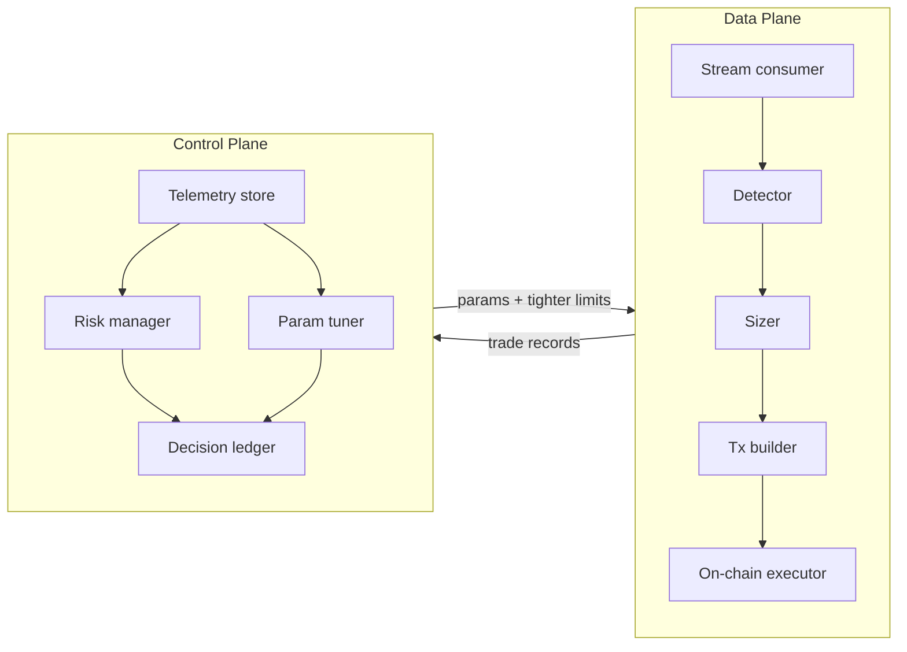

# Architecture

> **Deep dive:** this is the executive summary. A thorough, code-grounded
> reference — one chapter per crate, the on-chain program, end-to-end flows,
> safety invariants, and the roadmap seams — lives in
> [`architecture/`](architecture/README.md).

Lorenz separates two concerns that operate on completely different time scales and
must never be conflated: the **data plane** (microseconds, deterministic) and
the **control plane** (seconds to minutes, intelligent). This document explains
the split, the data flow, and where each crate fits.

## The two planes

### Data plane (hot path)

Latency-critical and fully deterministic. No LLM call ever sits here; a model
that takes seconds to think would lose the race. Responsibilities:

1. **Ingest** pool state from a Geyser/Yellowstone stream (push, not polling).
   *Status: streaming abstraction + deterministic `ReplaySource` implemented and
   feeding the detector (`lorenz-stream`); real account decoders for SPL token
   accounts and Raydium AMM v4 / CP-Swap implemented (`lorenz-dex::decoder`); the
   live Geyser transport is a documented seam.*
2. **Detect** candidate arbitrage cycles (`lorenz-graph`). Models the market as a
   token graph and finds profitable cycles via negative-cycle Bellman-Ford.
   *Status: implemented + tested.*
3. **Size** the opportunity exactly with integer AMM math (`lorenz-amm`),
   recomputing hop-by-hop output for a concrete notional. *Status: implemented.*
4. **Build & submit** the transaction (versioned tx, LUTs, Jito bundle).
   *Status: roadmap.*
5. **Execute** atomically on-chain (`programs/executor`), where the invariants
   live. *Status: guard logic implemented; flash-loan + swap CPIs roadmap.*

### Control plane (off the hot path)

Consumes telemetry and decides *limits* and *parameters* — it never signs hot-
path transactions. Responsibilities:

- **Risk management** (`lorenz-agent::risk`): hard ceilings, position caps and a
  consecutive-loss kill-switch. The agent may only ever *tighten* limits.
- **Parameter tuning** (`lorenz-agent::tuner`): adjusts priority fee / Jito tip
  from recent landing performance, bounded by ceilings.
- **Decision ledger** (`lorenz-agent::ledger`): append-only record of every
  control-plane action with its rationale, so the agent layer is auditable.
- **LLM orchestrator** (`lorenz-agent::orchestrator`): implemented. The LLM may
  only return one action from a closed set ([`AgentAction`]); the orchestrator
  validates and clamps every value against hard ceilings before applying it and
  recording it to the ledger. A real model client (OpenAI/Anthropic/local)
  implements the `LlmClient` trait; a deterministic `ScriptedLlmClient` is used
  for tests. The safety properties hold regardless of model output.

## Why this split is the whole point

An arbitrage system fails in two ways: it loses money on a bad trade, or an
operator/automation does something unbounded. Lorenz addresses both structurally:

- Bad trades are impossible to *settle* at a loss because the on-chain program
  reverts unless `balance_after >= balance_before + min_profit`.
- Unbounded automation is impossible because the control plane can only tighten
  limits, and withdrawal authority never leaves the vault owner.

This is what "auditable" means here: the guarantees are properties of the
runtime and the type system, not promises in a README.

## Data shared across planes

`lorenz-core` holds the vocabulary both planes agree on (`TokenId`, `PoolId`,
`Amount`, `Bps`, the typed `EngineConfig`, and the `TradeRecord` /
`Hop` telemetry types). It has no I/O and no Solana dependency, which is what
keeps traces replayable and tests fast.

## Phasing

The build order is deliberately economics-first:

1. **Phase 0/1 — prove the edge.** Backtester + detector + AMM math on real
   recorded data before spending on audit. (Largely present here.)
2. **Phase 2 — custom audited program.** Implement flash-loan CPI + swap route,
   test on localnet/devnet, external audit.
3. **Phase 3 — agentic control plane.** Telemetry pipeline + LLM agent over the
   existing bounded primitives.
4. **Phase 4 — non-custodial multi-tenant product.** Per-user vault + scoped
   delegate, on-chain fee accounting, dashboard, compliance review.
