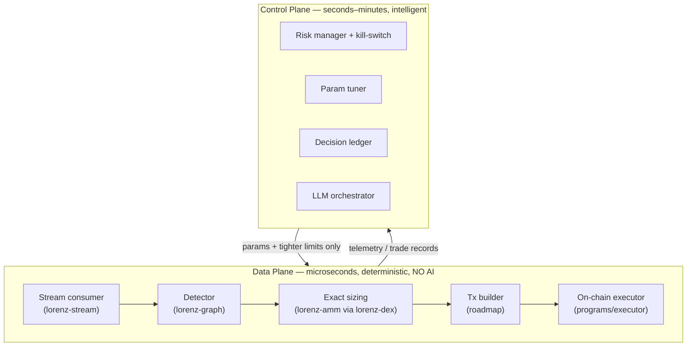

# 01 — System Overview

## What Lorenz Protocol is

Lorenz Protocol — deterministic, non-custodial on-chain arbitrage — is a
**reference architecture and engineering framework** for atomic,
flash-loan-funded arbitrage on Solana. It is
deliberately *not* a turnkey trading bot:

- It does not trade live and makes no profitability claims.
- The on-chain program is unaudited and missing two integrations (flash-loan CPI
  and swap route).
- It is published to demonstrate how a serious arbitrage stack is *designed*,
  with a hard rule that nothing is faked.

The deterministic core (AMM math, graph detection, account decoders, backtester,
control-plane primitives) genuinely works and is tested. The pieces requiring
live, co-located infrastructure and real capital are explicit **seams** that
return `NotImplemented` rather than pretending to work.

## The central idea: two planes, one-way control

Lorenz separates two concerns that operate on completely different time scales and
must never be conflated.

### Data plane (the hot path)

Latency-critical and fully deterministic. **No LLM call ever sits here** — a model
that takes seconds to think would lose every race. It runs the
`ingest → detect → size → build → submit → execute` loop. Every output amount is
computed in integer arithmetic so a backtest and the live engine agree to the
last base unit.

### Control plane (off the hot path)

Consumes telemetry and decides *limits* and *parameters*. It can be slow,
fallible, even LLM-driven — because it can only ever **tighten** limits and never
signs a hot-path transaction. Its authority is structurally bounded (chapter 05).

### The one-way contract

The interface between the planes is a small, typed contract:

- **Down** (control → data): parameters (priority fee, Jito tip) and *tighter*
  limits (position cap, kill-switch state).
- **Up** (data → control): `TradeRecord` telemetry (route, gross/net profit,
  whether submitted).

This is [ADR 0001](../adr/0001-data-control-plane-separation.md).

## Why the split is the whole point

An arbitrage system fails in two ways, and Lorenz addresses both *structurally*
rather than by promise:

| Failure mode | Structural defense | Where |
| --- | --- | --- |
| Settling a losing trade | On-chain program reverts unless `balance_after ≥ balance_before + min_profit` | `programs/executor` (I2) |
| Unbounded automation | Control plane can only tighten; withdrawal authority never leaves the owner | `lorenz-agent` (O3) + executor (I4) |

This is what "auditable" means in Lorenz: the guarantees are properties of the
runtime and type system, checkable by reading the code.

## Design principles

1. **Determinism in the data plane.** No floating-point money, no AI on the hot
   path. Every trade is reproducible from logs.
2. **Auditability as an on-chain property.** Safety is enforced by the program,
   not promised by the bot.
3. **Honesty as a feature.** Stubs are visible (`NotImplemented`); roadmap is
   labelled; no metric is fabricated. This is [ADR 0004](../adr/0004-honesty-and-strict-config.md),
   itself a reaction to a prior project that advertised unwired features and
   fabricated metrics.
4. **Non-custodial by design.** Users keep ownership of their vault; the bot gets
   a scoped delegate that cannot withdraw ([ADR 0002](../adr/0002-non-custodial-vault.md)).

## What works today vs. what is a seam

| Area | Status | Notes |
| --- | --- | --- |
| Constant-product AMM math (`lorenz-amm`) | ✅ | Integer math + property tests |
| Arbitrage detection (`lorenz-graph`) | ✅ | Negative-cycle Bellman-Ford |
| Pool model + CPMM quoting (`lorenz-dex`) | ✅ | |
| Single-tick CLMM quoting (`lorenz-dex::clmm`) | ✅ | `f64`; tick-crossing integer math is roadmap |
| Account decoders: SPL, Raydium AMM v4, Raydium CPMM, Whirlpool | ✅ | Real offsets, fixture-tested |
| Account decoders: Raydium CLMM, Meteora DLMM/DAMM, Pump, Solfi, Vertigo | 🔭 | `NotImplemented` decoders |
| Replay streaming (`lorenz-stream::replay`) | ✅ | Drives detector end-to-end |
| Geyser/Yellowstone transport (`lorenz-stream::geyser`) | 🟡 | Documented seam |
| Backtester + cost model (`lorenz-backtest`) | ✅ | Runnable binary |
| Risk manager, tuner, ledger, orchestrator (`lorenz-agent`) | ✅ | LLM client is a trait; real model client is roadmap |
| On-chain guard/fee/accounting (`programs/executor`) | ✅ | Pure arithmetic unit-tested |
| On-chain flash-loan CPI + swap route | 🟡 | `mod flash_loan`, `mod route` return `NotImplemented` |
| Tx builder / submission path | 🔭 | |

## Build phasing (economics-first)

From [`../ARCHITECTURE.md`](../ARCHITECTURE.md), the intended build order:

1. **Phase 0/1 — prove the edge.** Backtester + detector + AMM math on real
   recorded data, *before* spending on audit. (Largely present.)
2. **Phase 2 — custom audited program.** Implement flash-loan CPI + swap route;
   test on localnet/devnet; external audit.
3. **Phase 3 — agentic control plane.** Telemetry pipeline + LLM agent over the
   existing bounded primitives.
4. **Phase 4 — non-custodial multi-tenant product.** Per-user vault + scoped
   delegate, on-chain fee accounting, dashboard, compliance review.

Continue to [02 — Crate Topology](02-crate-topology.md).
