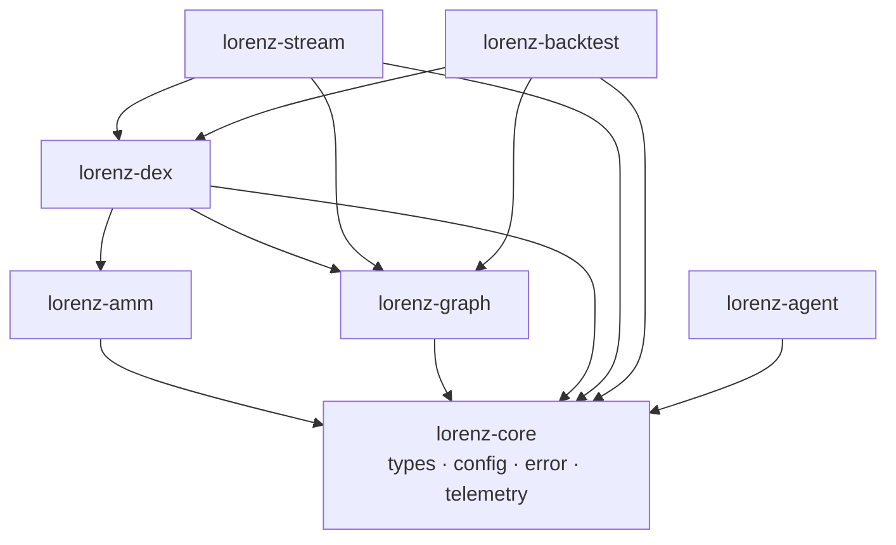

# 02 — Crate Topology

## Workspace shape

Lorenz Protocol is a Cargo workspace (`resolver = "2"`, edition 2021, `rust-version 1.85`)
of **seven host crates**, plus **one on-chain Anchor program** that is
intentionally excluded from the host workspace.

```
lorenz/
├── Cargo.toml                 # workspace: 7 members, excludes programs/executor
├── Anchor.toml                # on-chain program manifest (localnet)
├── rust-toolchain.toml
├── rustfmt.toml
├── crates/
│   ├── lorenz-core/             # shared vocabulary (no I/O, no Solana dep)
│   ├── lorenz-amm/              # constant-product math
│   ├── lorenz-graph/            # negative-cycle arbitrage detection
│   ├── lorenz-dex/              # pool model, quoting, account decoders
│   ├── lorenz-stream/           # transport-agnostic streaming -> detector
│   ├── lorenz-backtest/         # deterministic replay + cost model (+ binary)
│   └── lorenz-agent/            # control-plane primitives + LLM orchestrator
├── programs/
│   └── executor/              # on-chain atomic executor (Anchor) — excluded
└── docs/
```

## Dependency graph (host crates)

Arrows point from a crate to its internal dependencies. The graph is a strict DAG
with `lorenz-core` at the root.



Key observations:

- **`lorenz-core` depends on nothing internal** and has no I/O, RPC, or Solana
  dependency. This is what keeps traces replayable and tests fast (it is the
  deterministic vocabulary both planes agree on).
- **`lorenz-dex` is the convergence point of the data plane**: it depends on
  `lorenz-amm` (to price CPMM swaps) and `lorenz-graph` (to emit `Edge`s).
- **`lorenz-agent` only depends on `lorenz-core`.** The control plane shares the
  config/types vocabulary but is otherwise independent of the data-plane crates —
  consistent with the one-way contract in chapter 01.
- **`lorenz-stream` and `lorenz-backtest` are the two "drivers"** that turn a
  sequence of pool states into detected/priced opportunities.

## Per-crate responsibility (one line each)

| Crate | Responsibility | Detail chapter |
| --- | --- | --- |
| `lorenz-core` | Domain newtypes, strict typed config, error type, telemetry records, tracing bootstrap | [03](03-core-domain-model.md) |
| `lorenz-amm` | Constant-product (`x·y=k`) integer swap math + property tests | [04](04-data-plane.md) |
| `lorenz-graph` | Market-as-graph; profitable-cycle detection via Bellman-Ford | [04](04-data-plane.md) |
| `lorenz-dex` | `Pool` model (CPMM + single-tick CLMM), `Quoter`, raw-account decoders | [04](04-data-plane.md) |
| `lorenz-stream` | `PoolSnapshotSource` abstraction; replay source + Geyser seam; `detect_stream` | [04](04-data-plane.md) |
| `lorenz-backtest` | Deterministic replay harness, shared cost model, runnable binary | [07](07-backtester.md) |
| `lorenz-agent` | Risk manager, kill-switch, param tuner, decision ledger, LLM orchestrator | [05](05-control-plane.md) |
| `programs/executor` | On-chain atomic executor; the five hard invariants | [06](06-onchain-program.md) |

## Why the on-chain program is excluded from the workspace

The root `Cargo.toml` lists `exclude = ["programs/executor"]`. The reason is
practical and stated in the manifest comment:

> The on-chain program lives in `programs/` and is built with the Solana/Anchor
> toolchain (`anchor build`). It is intentionally excluded from the host
> workspace so that `cargo test` at the root stays fast and toolchain-free.

Consequences:

- `cargo test --workspace` at the root needs **no Solana toolchain** and runs the
  full off-chain test suite quickly.
- The program is built separately with `anchor build` (or its pure logic tested
  with `cargo test --lib` inside `programs/executor`, which is what CI does — see
  chapter 06 and `.github/workflows/ci.yml`).
- The program keeps its **own** `Cargo.lock` (`programs/executor/Cargo.lock`)
  because it resolves against the Solana/Anchor dependency tree, not the host
  workspace.

## Shared third-party dependencies

Declared once in `[workspace.dependencies]` and inherited by member crates:

| Dependency | Used for |
| --- | --- |
| `serde` / `serde_json` | (De)serialization of config, telemetry, market files |
| `toml` | Parsing `EngineConfig` from TOML |
| `thiserror` | Library error types (`lorenz-core::Error`, `DecodeError`, `StreamError`) |
| `anyhow` | Application-level errors |
| `tracing` / `tracing-subscriber` | Structured logging / observability |
| `proptest` | Property-based tests in `lorenz-amm` |
| `bs58` | Base58 encoding of raw pubkeys in `lorenz-dex::decoder` |

The release profile is tuned for the latency goal: `opt-level = 3`,
`lto = "thin"`, `codegen-units = 1`.

## Toolchain & lint posture

- `rust-toolchain.toml` pins the toolchain; `rustfmt.toml` pins formatting.
- CI runs `cargo fmt --all --check`, `cargo clippy --workspace --all-targets`
  with `RUSTFLAGS="-D warnings"` (warnings are errors), `cargo test --workspace`,
  and a `cargo run -p lorenz-backtest` smoke run.
- The on-chain crate is **not** built with `-D warnings` in CI because the Anchor
  `Accounts` derive emits benign `anchor-debug` cfg warnings outside the
  project's control.

Continue to [03 — Core Domain Model](03-core-domain-model.md).
