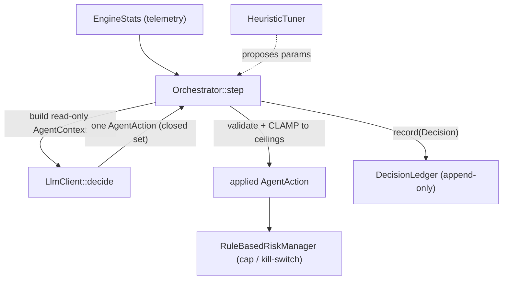

# 05 — Control Plane (`lorenz-agent`)

The control plane is the *"brain that governs", never the "hand that executes"*.
Nothing in `lorenz-agent` runs on the hot path: these types decide **limits** and
**parameters** that the deterministic data plane and the on-chain program then
enforce. An LLM agent sits on top of these primitives, but the primitives
themselves are plain, testable Rust, **so the safety properties do not depend on
a model's output**.

Two ideas hold the design together:

- `RiskManager` owns hard guarantees (kill-switch, position caps). Even a
  misbehaving agent cannot widen these beyond the configured ceiling.
- `DecisionLedger` records *why* every change happened, so the agent layer is
  itself auditable after the fact.

Module map (`crates/lorenz-agent/src/`): `risk`, `tuner`, `ledger`, `llm`,
`orchestrator`.



---

## `risk` — hard ceilings + kill-switch ✅

### `RiskManager` trait

The behaviour the data plane relies on before/after each attempt:

```rust
trait RiskManager {
    fn pre_trade_check(&self, notional: u64) -> RiskDecision;  // allow this size?
    fn on_trade_result(&mut self, net_profit: i128);           // update from outcome
    fn is_killed(&self) -> bool;
}
```

`RiskDecision { allow: bool, reason: String }`.

### `RuleBasedRiskManager`

Deterministic, rule-based. State: `cfg: RiskConfig`, `consecutive_losses: u32`,
`killed: bool`, `dynamic_cap: Option<u64>`.

**The cap can only tighten.** The effective cap is the *tighter* of the configured
ceiling and any dynamic cap:

```rust
fn effective_cap(&self) -> u64 {
    match self.dynamic_cap { Some(d) => d.min(self.cfg.max_position),
                             None    => self.cfg.max_position }
}
```

`tighten_cap(requested) -> u64` clamps to `cfg.max_position` and returns the value
*actually applied* — a request above the ceiling is never honored as written.

**Pre-trade check** denies if killed (`"kill-switch active"`) or if `notional`
exceeds the effective cap; otherwise allows.

**Kill-switch logic** (`on_trade_result`): a negative `net_profit` increments the
loss streak and trips `killed` once it reaches `max_consecutive_losses`; any
non-negative result resets the streak to zero. `trip_kill_switch()` /
`reset_kill_switch()` allow manual operator/agent control (reset also clears the
streak).

Tests prove: oversized positions rejected; the switch trips on the *N*-th
consecutive loss; a win resets the streak; and an agent cannot widen the cap
beyond the ceiling.

This is the enforcement half of invariant **O3**.

---

## `tuner` — parameter proposals ✅

Proposes data-plane execution parameters from recent performance.

### Inputs and outputs

```rust
struct EngineStats { land_rate: f64, avg_net_profit: f64, samples: u32 }
struct ParamProposal { priority_fee_lamports: u64, jito_tip_lamports: u64 }

trait ParamTuner {
    fn propose(&self, current: ParamProposal, stats: &EngineStats) -> ParamProposal;
}
```

### `HeuristicTuner` — deterministic baseline

Config: `low_land_rate` (default `0.5`), `high_land_rate` (`0.9`),
`max_priority_fee` (`1_000_000`), `max_tip` (`200_000`).

Logic:

| Condition | Action |
| --- | --- |
| `samples < 5` | Hold — not enough data, leave parameters untouched. |
| `land_rate < low_land_rate` | **Under-landing**: bid fees/tips up by 50% (`×3/2`). |
| `land_rate > high_land_rate` | **Landing reliably**: ease off 10% (`×9/10`) to preserve margin. |
| otherwise | Hold. |

All arithmetic is `saturating_mul`, and the result is `.min()`-clamped to the
ceilings, so a single window can never blow up the bid. An LLM-backed tuner is
roadmap and would implement the same `ParamTuner` trait — a drop-in replacement
that still flows through the same ledger and ceilings.

---

## `ledger` — append-only decision record ✅

Every control-plane action is recorded with a human-readable rationale, so you can
always answer *"why did the system do that?"* from the ledger alone. This is
invariant **O5**.

```rust
enum DecisionKind { TightenCap, KillSwitchTripped, KillSwitchReset, ParamChange, Note }

struct Decision {
    ts: u64, kind: DecisionKind, rationale: String,
    before: Option<String>, after: Option<String>,   // structured before/after
}

struct DecisionLedger { entries: Vec<Decision> }   // append-only
```

`record(decision)` logs via `tracing::info!` and pushes to `entries`. **There is
deliberately no method to mutate or delete past entries** — the only access is
`entries()`, `len()`, `is_empty()`. The struct derives `Serialize`/`Deserialize`
so a ledger can be persisted/replayed.

---

## `llm` — the LLM boundary ✅ (trait) / 🔭 (real client)

An LLM **never touches the hot path and never signs anything.** Its entire
influence is to return one `AgentAction` from a small, closed set. This is the
core safety idea: even a fully hallucinated model output cannot widen a limit,
raise a fee, or move funds, because the action space is constrained and every
value is clamped downstream.

### The closed action set

```rust
enum AgentAction {
    Hold,                            // do nothing this step
    TightenCap { to: u64 },          // request a tighter cap (clamped)
    AdjustParams(ParamProposal),     // request new params (clamped)
    TripKillSwitch { reason: String },
    Note(String),                    // observation, no state change
}
```

> Adding a variant is a deliberate, reviewable expansion of the agent's authority.

### Context handed to the model (read-only)

```rust
struct AgentContext {
    stats: EngineStats, current_params: ParamProposal,
    current_cap: u64, max_cap: u64, killed: bool,
}
```

### The trait and the test client

```rust
trait LlmClient { fn decide(&self, ctx: &AgentContext) -> AgentAction; }
```

- A **production client** (OpenAI/Anthropic/local) implements `LlmClient` by
  prompting the model with `AgentContext` and parsing a tool call into an
  `AgentAction`. This is roadmap.
- **`ScriptedLlmClient`** ✅ replays a fixed script of actions (then `Hold`s) — a
  deterministic implementation for tests and offline dry-runs of the
  orchestration logic.

---

## `orchestrator` — the safety layer ✅

The `Orchestrator<C: LlmClient>` is the layer between an LLM's suggestion and the
engine's state. It owns the `RuleBasedRiskManager`, current `params`, a
`param_ceiling`, the `DecisionLedger`, and a monotonic `clock`.

### One step

```rust
fn step(&mut self, stats: EngineStats) -> AgentAction
```

1. Build a read-only `AgentContext` from current stats and limits.
2. Ask `self.llm.decide(&ctx)` for one `AgentAction`.
3. **Validate and clamp** it against hard ceilings.
4. Apply the clamped action and record it (with rationale) to the ledger.
5. Return **the action actually applied**, which may differ from what the model
   asked for.

### Clamping per action

| Action | Clamp applied |
| --- | --- |
| `Hold` | none |
| `TightenCap { to }` | `risk.tighten_cap(to)` → clamped to `cfg.max_position`; records before/after cap |
| `AdjustParams(req)` | each field `.min()`-clamped to `param_ceiling`; records before/after params |
| `TripKillSwitch { reason }` | trips the switch; records the reason |
| `Note(text)` | records the note, no state change |

**Every branch records to the ledger**, so the audit trail is complete by
construction.

### The property that matters

The orchestrator returns the action it *actually applied*. A model can never
exceed a ceiling. Tests demonstrate:

- A model "hallucinating" a cap of `999_999_999` is clamped to the configured
  `1_000_000`.
- Params of `10_000_000 / 9_000_000` are clamped to the ceiling `500_000 /
  50_000`.
- A kill-switch trip is applied and logged.
- Every action is recorded in order with an incrementing timestamp.

This is the clamping half of invariant **O3**: *the LLM may only return one
action from a closed set, and the orchestrator clamps every value before applying
it.*

Continue to [06 — On-chain Program](06-onchain-program.md).
