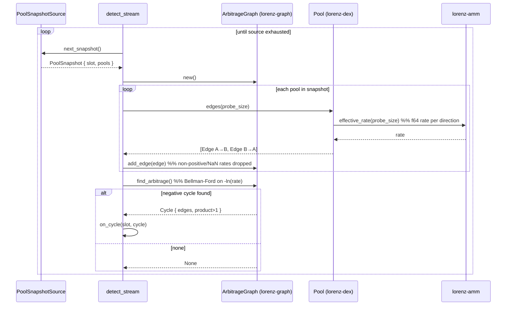
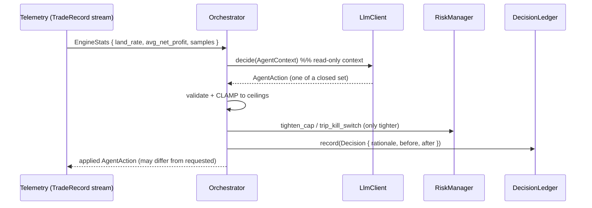

# 08 — End-to-End Flows

This chapter traces the data across crate boundaries. Three flows: the
**detection pipeline** (works today), the **backtest run** (works today), and a
**live atomic trade** (mostly roadmap, shown to make the seams concrete).

---

## Flow A — Detection over a stream ✅

What `lorenz-stream::detect_stream` does, snapshot by snapshot. This is the exact
analysis step the live engine runs; only the *source* changes.



Key point: the rates that build the graph are `f64` at a single probe size, so the
`Cycle` is a **candidate**. Certifying profit requires the exact, integer,
size-aware re-pricing shown in Flow B.

---

## Flow B — Backtest run ✅

`lorenz-backtest::run_backtest` reuses the same detection step, then adds exact
sizing and the cost model.

```mermaid
sequenceDiagram
    participant M as Market (JSON)
    participant RB as run_backtest
    participant G as ArbitrageGraph
    participant SC as simulate_cycle
    participant CM as CostModel
    participant Rec as TradeRecord

    RB->>RB: notional = min(market.notional, risk.max_position)
    loop each MarketSnapshot
        RB->>G: add pool.edges(notional) for every pool
        RB->>G: find_arbitrage()
        alt candidate cycle
            G-->>RB: Cycle
            RB->>SC: simulate_cycle(pools, cycle, base, notional)
            SC->>SC: rotate cycle to start at base token
            loop each hop
                SC->>SC: out = pool.quote(token_in, amount)  %% exact integer
                SC->>SC: amount = out  (drop if 0)
            end
            SC-->>RB: (route: Vec<Hop>, final_out)
            RB->>RB: gross = final_out - notional
            RB->>CM: total_cost(notional, route.len())
            CM-->>RB: cost
            RB->>RB: net = gross - cost ; submitted = net >= min_profit
            RB->>Rec: push TradeRecord{ ts, route, notional, gross, net, submitted }
        else none
            G-->>RB: None  (skip)
        end
    end
    RB-->>M: BacktestReport { records, candidates_found, profitable_after_costs, total_net_profit }
```

The same `CostConfig` type feeds both this and the (future) live engine, so the
simulation cannot be quietly rosier than production (O4).

---

## Flow C — Live atomic trade (mostly 🔭 / 🟡)

The intended production path. **Bold** steps exist and are tested; the rest are
seams or roadmap. Shown to make precise *what is missing*.

```mermaid
sequenceDiagram
    participant Gy as Geyser stream (🟡 seam)
    participant Dec as lorenz-dex decoders (✅)
    participant Det as detector (✅)
    participant Risk as RuleBasedRiskManager (✅)
    participant Bld as Tx builder (🔭)
    participant Ex as on-chain executor (✅ guards / 🟡 CPIs)
    participant Kam as Kamino + DEXs (🔭 CPI)

    Gy-->>Dec: account updates (pool + vault) — transport NOT wired
    Dec->>Dec: decode_accounts + token_account_amount + assemble  ✅
    Dec->>Det: PoolSnapshot
    Det->>Det: build graph, find_arbitrage  ✅
    Det->>Risk: pre_trade_check(notional)  ✅
    Risk-->>Det: allow / deny (cap, kill-switch)
    Det->>Bld: size exactly + build versioned tx + Jito bundle  🔭
    Bld->>Ex: execute_arbitrage(notional, min_profit)
    Ex->>Kam: flash_loan::borrow  🟡 NotImplemented
    Ex->>Kam: route::execute_route (per-hop swap CPI)  🟡 NotImplemented
    Ex->>Kam: flash_loan::repay  🟡 NotImplemented
    Ex->>Ex: profit = after - before ; require(profit >= min_profit)  ✅
    Ex->>Ex: fee = protocol_fee(profit, fee_bps) ; transfer  ✅
    Ex-->>Det: emit ArbitrageExecuted | revert (atomic)
    Det->>Risk: on_trade_result(net_profit)  ✅  (telemetry up-channel)
```

### Where each gap lives

| Gap | Status | Where | Chapter |
| --- | --- | --- | --- |
| Geyser/Yellowstone transport | 🟡 | `lorenz-stream::geyser` (`connect` → `NotImplemented`) | 04 |
| Tx builder / submission (versioned tx, LUTs, Jito bundle) | 🔭 | not in code | 01 |
| Flash-loan borrow/repay CPI | 🟡 | `programs/executor` `mod flash_loan` | 06 |
| Multi-DEX swap route CPI | 🟡 | `programs/executor` `mod route` | 06 |
| CLMM/DLMM decoders + tick-crossing math | 🔭 | `lorenz-dex::decoder` roadmap decoders | 04 |
| Real LLM client | 🔭 | implement `lorenz-agent::LlmClient` | 05 |

---

## How the control plane closes the loop

Independently of the hot path, on a slower cadence:



The down-channel is **only ever tighter limits + bounded params**; the up-channel
is `TradeRecord`/`EngineStats`. Neither plane can violate the other's guarantees:
the agent cannot widen a cap, and the chain still refuses any unprofitable settle.

Continue to [09 — Safety & Invariants](09-safety-and-invariants.md).
