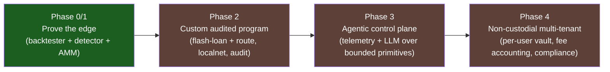

# 10 — Roadmap & Seams

Lorenz draws a hard line between **what works** and **what a production deployment
additionally needs**, and it encodes that line in the type system: every
unfinished path is a real, compiling type that returns an explicit
`NotImplemented` rather than a faked success. This chapter is the single index of
those boundaries.

Legend (from the README): 🟡 **seam** (typed, documented, compiles, returns
`NotImplemented`) · 🔭 **roadmap** (scoped, not in code).

---

## The seams, by location

| Seam | Status | Location | Returns | What wiring it requires |
| --- | --- | --- | --- | --- |
| Geyser/Yellowstone transport | 🟡 | `crates/lorenz-stream/src/geyser.rs` → `GeyserSource::connect` | `StreamError::NotImplemented` | Add `yellowstone-grpc-client` in a deployment crate; connect, subscribe to pool + vault accounts, decode (already implemented), assemble, emit `PoolSnapshot`. |
| Flash-loan borrow | 🟡 | `programs/executor` `mod flash_loan::borrow` | `ExecutorError::NotImplemented` | CPI `flash_borrow_reserve_liquidity` (Kamino) for `notional` of base mint into `vault_token_account`; must pair with `repay` in the same tx. |
| Flash-loan repay | 🟡 | `programs/executor` `mod flash_loan::repay` | `ExecutorError::NotImplemented` | CPI `flash_repay_reserve_liquidity` for principal + provider fee. |
| Multi-DEX swap route | 🟡 | `programs/executor` `mod route::execute_route` | `ExecutorError::NotImplemented` | Walk the route in `remaining_accounts`, one swap CPI per hop (Raydium, Meteora, Whirlpool, …). |
| Raydium CLMM decoder | 🔭 | `lorenz-dex::decoder::RaydiumClmmDecoder` | `DecodeError::NotImplemented` | Sqrt-price + tick-array layout. |
| Meteora DLMM decoder | 🔭 | `lorenz-dex::decoder::MeteoraDlmmDecoder` | `DecodeError::NotImplemented` | Bin layout. |
| Meteora DAMM / Pump / Solfi / Vertigo decoders | 🔭 | `lorenz-dex::decoder` roadmap CPMM decoders | `DecodeError::NotImplemented` | Per-venue account layout adaptation. |
| Tick-crossing CLMM math | 🔭 | `lorenz-dex::clmm` (currently single-tick `f64`) | — (returns single-tick estimate) | Full Q64.64 integer math crossing initialized ticks. |
| Real LLM client | 🔭 | implement `lorenz-agent::LlmClient` | — | Prompt a model with `AgentContext`, parse a tool call into one `AgentAction`. |
| Tx builder / submission | 🔭 | not present | — | Versioned tx, LUTs, Jito bundle construction + submission on low-latency infra. |

---

## Production requirements (from the README)

These are explicitly *not done* in this reference framework and together
constitute the scope of a production build:

1. **Concentrated-liquidity decoders** (Whirlpool is done; Raydium CLMM, Meteora
   DLMM remain) with a tick/sqrt-price pricing model rather than constant-product.
2. **On-chain flash-loan borrow/repay CPI and multi-DEX swap route** (`mod
   flash_loan`, `mod route`).
3. **Live Geyser/Yellowstone transport** behind `lorenz-stream`'s seam, plus the tx
   submission path, on co-located low-latency infrastructure.
4. **An external audit** of the on-chain program before any use with real capital.
5. **The LLM-backed agent** on top of the existing bounded control-plane
   primitives.
6. **Multi-tenant onboarding** and the non-custodial vault UX.

The README is also candid about the macro constraint: production arbitrage is an
*infrastructure* problem (co-location, premium/staked RPC + streams, millisecond
bundle tuning). A laptop clone will not out-race established searchers — and
understanding that is itself part of what the repo demonstrates.

---

## Phasing (economics-first)

From [`../ARCHITECTURE.md`](../ARCHITECTURE.md) and
[ADR 0003](../adr/0003-custom-onchain-program.md):

- **Phase 0/1** is largely present (green): the deterministic edge-proving stack.
- **Phases 2–4** are the production build, in deliberate order so the economic
  edge is validated *before* money is spent on audit and infrastructure.

---

## Two reasonable ways to use the repo (from the README)

- **(A) Self-serve, at your own risk.** Fork it, implement the roadmap pieces for
  your own infrastructure, operate it yourself. MIT-licensed; you own the outcome.
- **(B) Custom build.** Use this architecture as the starting point; the
  production requirements above are the scope of work.

---

## Design rule that keeps the seams honest

From [ADR 0004](../adr/0004-honesty-and-strict-config.md): unimplemented paths
return an explicit `NotImplemented` error, **never a fake success**; every README
claim is verifiable from code/chain or labelled roadmap; strict config fails loud.
The repository is "defensible *because it is accurate*" — the property that
survives close review by a human or an AI.

Continue to [11 — Glossary](11-glossary.md).
